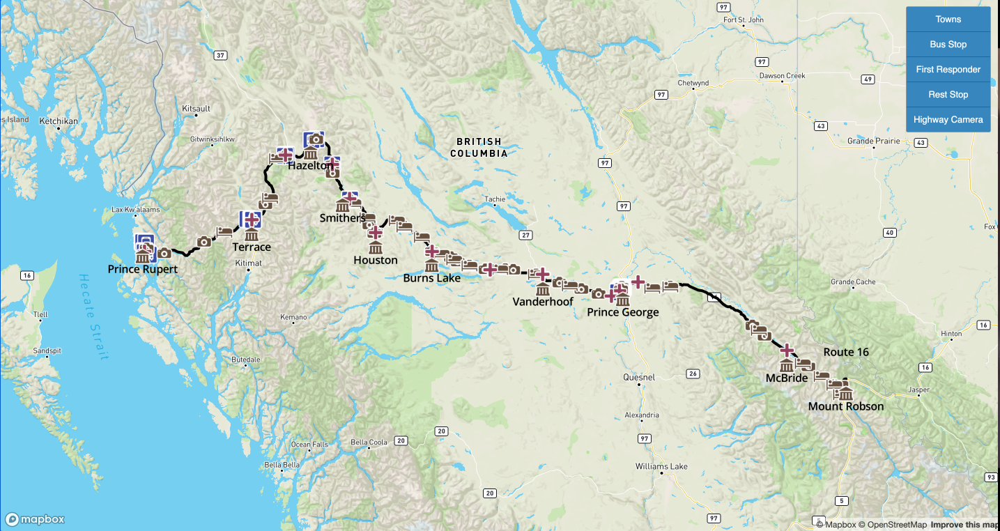
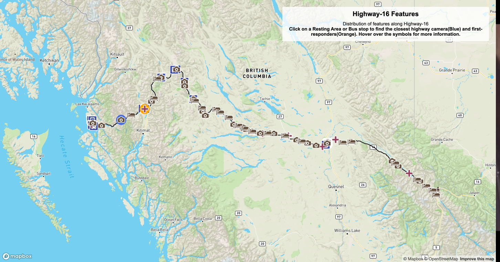

## ‘NO MORE STOLEN SISTERS’ - THE HIGHWAY OF TEARS
Our comprehensive spatial manifesto honoring and remembering Missing and Murdered Indigenous Women in Northern BC, Canada.
Group Members: Sara Ng, Felicia Yue, Mark Leung, Eduardo Fuks

Project Essay: https://feliciay2.wixsite.com/geob472mmiwg

### Interactive Map 1
HIGHWAY-16 FEATURES AND AMENTITIES 
https://ubc-geob472-spring2021.github.io/Final-Project-MMIWG/Final/HTML%20Maps/Final-interactive-pt1.html

### Interactive Map 2 
HIGHWAY-16 Spatial Relation between Features 
https://ubc-geob472-spring2021.github.io/Final-Project-MMIWG/Final/HTML%20Maps/Final-interactive-pt2.html

